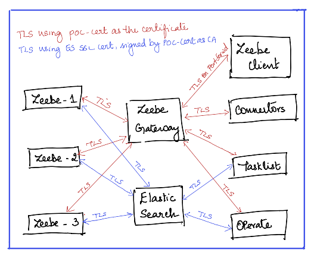

# Camunda 8 Helm Profile: Ingress NGINX for AWS EKS

A configuration for Camunda Platform 8
that uses [NGINX](https://www.nginx.com/products/nginx-ingress-controller/)
as an [Ingress Controller](https://kubernetes.io/docs/concepts/services-networking/ingress-controllers/).

This folder contains a [Helm](https://helm.sh/) [values file](camunda-values.yaml)
for installing the [Camunda Platform Helm Chart](https://helm.camunda.io/)
on an existing AWS EKS cluster (if you don't have one yet,
see [Kubernetes Installation for Camunda 8 on AWS](../../../../README.md)).
A [Makefile](Makefile) is provided to automate the installation process.

This profile provide a reference to configure a secure version of the Camunda platform with the below

1. Elastic search with basic authentication over TLS
2. Secure communication among the brokers and gateway instances over TLS
3. Secure Gateway - Client communication over TLS (This also implies that the Tasklist/Operate connectivity to the gateway needs to be on TLS)

NOTE: If using self-signed certificates for TLS in development environments, the Certificate path must be provided for all camunda applications & in some cases adding these self-signed certificates to the trust store of the individual applications is necessary. These are provided in this example as well. 

## Installation

If this is your first time here, make sure you have [installed the prerequisites](../../../../README.md).

After you've installed the prerequisites, follow these steps:

Open a Terminal and `cd` into this directory.

Edit the [Makefile](Makefile) found in this directory and set the following bash variables so that they are appropriate for your specific environment.

If you don't have a Kubernetes cluster, the values provided will be used to create a new cluster. Otherwise, the values are used to connect and manage an existing cluster.

```
region ?= us-east-1
zones ?= ['us-east-1a', 'us-east-1b']
clusterName ?= CLUSTER_NAME
machineType ?= c6i.4xlarge
# TODO: Currently, auto scaling configuration using these scripts for AWS is not working
# desiredSize is used as the starting size of the cluster
desiredSize ?= 3
minSize ?= 1
maxSize ?= 6
certEmail ?= YOUR_EMAIL@camunda.com
```

> :information_source: **Note** Currently autoscaling for AWS is not working yet. For now, desiredSize is used to set
> the starting size of the cluster

If you need to create a new EKS Cluster, run `make kube`. Note that the [EBS CSI Driver Addon](https://docs.aws.amazon.com/eks/latest/userguide/ebs-csi.html) will be automatically configured for Kubernetes versions >= 1.23

> :information_source: **Warning** Persistent volumes will fail on AWS EKS versions >=1.23 unless the [EBS CSI Driver Addon](https://docs.aws.amazon.com/eks/latest/userguide/ebs-csi.html) is installed and configured correctly

Once you have an EKS Cluster, run `make` to do the following:

1. Set up a Kubernetes letsencrypt certificate manager
2. Installs a Kubernetes Nginx Ingress Controller. A corresponding AWS Load Balancer is provisioned automatically
3. Scripts used by the `Makefile` will attempt to find the ip address of the Load Balancer. This ip address is then used generate a `camunda-values-ingress-tls-aws-secure.yaml` file.
4. A self-signed certificate is created using cert-manager. Refer the file `self-signed-cert.yaml` for details on how this is done.
5. Helm is used to install Camunda 8 using the `camunda-values-ingress-tls-aws-secure.yaml` file with the Load Balancer IP Address / with dnsLabel.LB-IP.nip.io if you opt for nip.io in the make file settings
6. The ingress controller is annotated so that letsencrypt tls certificates are provisioned by cert manager.

### Component setup


**IMPORTANT TO NOTE**: To connect to this zeebe instance from camunda clients, you need the public certificate for the gateway

* In case of port-forwards to zeebe gateway without the ingress route, export the certificate that is used for SSL setup in the gateway. 
  * This file can be referred to in the zeebe.ca.certificate.path property in the application.properties or ZEEBE_CA_CERTIFICATE_PATH environment variable for the client.
    `kubectl get secret poc-cert -n camunda  -o jsonpath='{.data.tls\.crt}' | base64 --decode > poc-certificate.crt
     export ZEEBE_CA_CERTIFICATE_PATH = /path/to/poc-certificate.crt`

* In case of connecting from a zeebe client via the ingress, export the tls certificate of the ingress. 
  * This can then be referred to in the zeebe.ca.certificate.path property in the application.properties or ZEEBE_CA_CERTIFICATE_PATH environment variable for the client.
    `echo | openssl s_client -servername jkk.52.77.128.219.nip.io -connect jkk.52.77.128.219.nip.io:443 | sed -ne '/-BEGIN CERTIFICATE-/,/-END CERTIFICATE-/p' > /path/to/poc-certificate.crt
     export ZEEBE_CA_CERTIFICATE_PATH = /path/to/poc-certificate.crt`

### Troubleshooting Hint

When TLS is turned on at the Gateway & if using nginx ingress controller, update the zeebe-grpc ingress to use `GRPCS` instead of `GRPC` for the annotation  `nginx.ingress.kubernetes.io/backend-protocol: GRPCS`

In case of other ingress controllers, beware of the fact that zeebe gateway expects TLS traffic & hence the connection from your ingress to the gateway service should also be on TLS & not plain traffic

### Reinstallation
You can re-install this profile easily. First run `make clean` to remove all kubernetes objects created by `make`. Then, re-run `make` to re-install.

WARNING!!! This will completely destroy your cluster and everything inside of it!!! To completely delete your cluster, run `make clean-kube`.

See the main README for [Troubleshooting, Tips, and Tricks](../../../../README.md#troubleshooting-tips-and-tricks)
