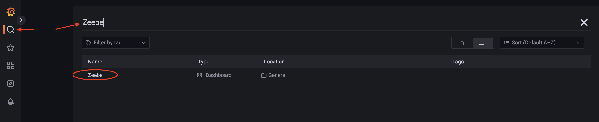
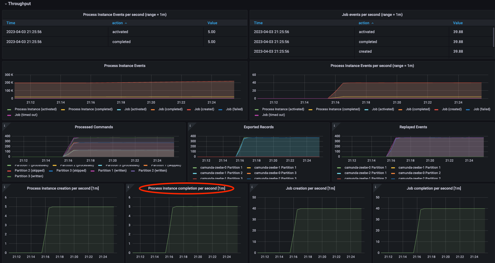
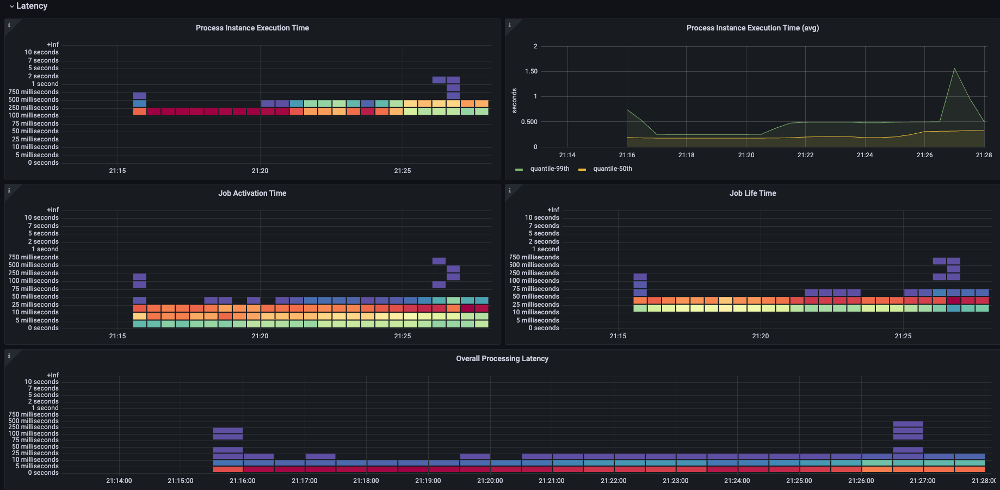

# Camunda 8 Helm Profile: Benchmark

This folder contains a [Makefile](Makefile) that can be used to run the [Camunda 8 Benchmark Tool](https://github.com/camunda-community-hub/camunda-8-benchmark) to gather performance metrics.

If you don't have a Kubernetes Cluster yet, see the main [README](../README.md) for details on how to create a cluster on the popular cloud providers.

# Usage

Here's a spreadsheet useful for tracking Performance Benchmarks: 

https://docs.google.com/spreadsheets/d/1YZFp5uDd4783qTr7fvQIyXzoz8o01GLadurXLXU9sMc/edit

Here's a webinar about Camunda 8 Performance: 

https://page.camunda.com/wb-zeebe-performance-engine

## Prometheus and Grafana

Although not technically required, it's extremely useful to have Grafana and Prometheus setup in the Cluster that you want to benchmark. Everything needed to install and configure Prometheus and Grafana can be found inside the [metrics folder](../metrics). Change directory to that folder, and follow the steps outlined inside [metrics/README.md](../metrics/README.md). After following those steps, you should be able to sign into your Grafana dashboard.  

From your Grafana Dashboard, click the magnifying glass in the left nav menu, and search for the `Zeebe` Dashboard by Name. 

## Run a Benchmark

Here are the high level steps of running benchmarks:  

1. Create a sample process diagram
2. Configure a sample payload.json
3. Set benchmark parameters
4. Install Camunda to your Kubernetes Cluster
5. Deploy process diagram to Camunda Engine
6. Run the Benchmark
7. Clean up environment
8. Go back to step 3 (to run another benchmark)

### 1. Create Sample Process Diagram

The [BenchmarkProcess.bpmn](../bpmn/BenchmarkProcess.bpmn) file is the process diagram that will be used for the benchmark. By default, this is a simple process with 8 service tasks in sequence. Feel free to replace with your own process diagram.

### 2. Configure sample payload

Each time the benchmark tool starts a new process instance, it will send an instance variable payload as defined by [payload.json](payload.json). Feel free to replace this file with a representation of the payload for your use case. 

### 3. Set Benchmark Parameters

The [camunda-values.yaml](camunda-values.yaml) file controls how the Camunda 8 Components will be installed. For example, you might be curious to test performance with 10 partitions, or with 6 brokers, or, perhaps you're curious to see if 10 brokers performs better than 3.

For a complete list of configuration options, see the [Camunda helm Chart docs here](https://github.com/camunda/camunda-platform-helm/tree/main/charts/camunda-platform#camunda-platform-8-helm-chart).

The [benchmark.yaml](benchmark.yaml) file controls how the Benchmark tool behaves. Configure the settings inside this file for the test you want to perform. 

The Benchmark tool has 2 main responsibilities: a) to simulate workers and b) to simulate load

#### a. Simulate Zeebe Client Workers

Notice that the [BenchmarkProcess.bpmn](../bpmn/BenchmarkProcess.bpmn) contains 8 service tasks. These service tasks are configured with types `camunda-task-1`, `camunda-task-2`, etc , `camunda-task-8`.  

When you start the Benchmark tool, it will dynamically generate a Zeebe Client Worker for each of these service tasks. For example, the configuration parameter named `benchmark.multipleJobTypes` defines the number of workers to simulate. By default this is set to `8` to match the 8 service tasks in the diagram. 

#### b. Simulate Load

In addition to simulating Zeebe Client Workers, the Benchmark tool also simulates load on your environment. Set the parameters inside [benchmark.yaml](benchmark.yaml) to control the amount of load simulated. For example, by default, `benchmark.startPiPerSecond` is set to `5`, which means that once started, the Benchmark Tool will start 5 process instances each second. 

The config option `benchmark.warmupPhaseDurationMillis` controls the period of time that the benchmark tool will continue to create 5 process instances per second (or whatever Pi/s you configured). After the warm up phase, the benchmark tool will increase the number of process instances created per second at a rate of `benchmark.startPiIncreaseFactor`. 

### 4. Install Camunda to your Kubernetes Cluster

Now you're ready to test! 

(Note that you can run all steps 4 - 6 by simply running `make`. However, it might be useful to run each of these steps manually. For example, maybe you have a existing camunda installation that you want to reuse? If so, skip step 4 and head to step 5) 

This command: `make camunda await-zeebe` will install Camunda Components into your Kubernetes Cluster as specified by your [camunda-values.yaml](camunda-values.yaml) file. The `awiat-zeebe` waits for zeebe to report that it's healthy.  

### 5. Deploy process diagram to Camunda Engine

This command: `make deploy-models` will deploy the process diagram that has been staged in [BenchmarkProcess.bpmn](../bpmn/BenchmarkProcess.bpmn)

### 6. Run the Benchmark

This command: `make benchmark` creates a `benchmark` deployment based on [benchmark.yaml](benchmark.yaml). This deployment will start the Benchmark Tool. The benchmark tool will setup Job Workers and then start creating instances to simulate load on the environment. 

### 7. Clean up environment

After you have let your benchmark run for as long as needed, run `make clean-benchmark` to stop the benchmark tool. And run `make clean-camunda` if you'd like to clear your Camunda Components from Kubernetes. 

### 8. Go back to step 3 (to run another benchmark)

Go back to step 3 and change a few parameters. Rerun the benchmark and compare results. 

# Analyzing Results

The Grafana Dashboard contains a wealth of metrics about the running environment. There is too much to cover everything here. But, here are a few highlights. 

The `Throughput` section, and specifically, the `Process instance completion per second` shows the number of process instances created by second by the Benchmark Tool. This will stay constant during the warmup period, and then constantly increase after the warmup period ends. 

The `Latency` section contains heat maps and charts that show `Process Instance Excecution Time` and `Job Life Time`. 

As the load increases, eventually, the process execution times will become longer than what's acceptable for your use case. For example, if you require all process instances to run in under 10 seconds, then watch until these charts show that process instances are taking longer than 10 seconds to complete. At this point, compare the number of process instances created per second and this should give a good baseline of max throughput for a given latency requirement. 

