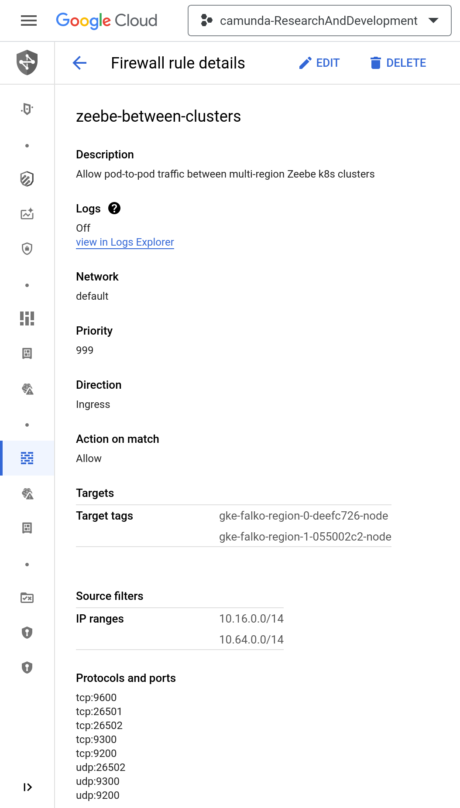

# Multi-Region Active-Active Setup for Camunda 8

Note: This Helm profile requires [version 8.3.2 (or later) of Camunda's Helm chart](https://github.com/camunda/camunda-platform-helm/releases/tag/camunda-platform-8.3.2).

## WARNING
If you want Camunda enterprise support for your multi-region setup,
you must have your configuration and run books reviewed by Camunda before going to production.
Due to the complexity of operating multi-region setups and the dependencies on the underlying Kubernetes prerequisites,
this is required for us to be able to assist you in the event of an outage.
If you operate this incorrectly, you risk corrupting and losing all data, especially in the dual-region case.
Consider three regions if possible. As soon as you begin planning a multi-region setup, please contact your customer success manager.
Camunda reserves the right to restrict support if no review was performed prior to launch or if the review revealed significant risks.


## Prerequisite: Kubernetes Cross-Cluster Communication

A multi-region setup in Kubernetes really means a multi-cluster setup and that comes with a networking challenge: How to manage connectivity between my pods across different Kubernetes clusters? You should setup proper firewall rules and correctly route traffic among the pods. For that you have many options (in nor particular order):
* ["DNS Chainging" with kube-dns](https://youtu.be/az4BvMfYnLY?si=RmauCqchHwsmCDZZ&t=2004): That's the option we took in this example. We setup kube-dns automatically through a [python script](https://github.com/camunda-community-hub/camunda-8-helm-profiles/blob/main/google/multi-region/active-active/setup-dns-chaining.py) to route traffic to the distant cluster based on the namespace. This requires to have different namespaces in each cluster.
* [Istio](https://medium.com/@danielepolencic/scaling-kubernetes-to-multiple-clusters-and-regionss-491813c3c8cd) ([video](https://youtu.be/_8FNsvoECPU?si=dUOFwaaUxRroj8MP))
* [Skupper](https://medium.com/@shailendra14k/deploy-the-skupper-networks-89800323925c#:~:text=Skupper%20creates%20a%20service%20network,secure%20communication%20across%20Kubernetes%20clusters.)
* [Linkerd multi-cluster communication](https://linkerd.io/2.14/features/multicluster/)
* [Submariner](https://submariner.io/)
* [KubeStellar](https://kubestellar.io)
* [Google Kubernetes Engine (GKE) Fleet Management](https://cloud.google.com/kubernetes-engine/docs/fleets-overview)
* [Azure Kubernetes Fleet Manager](https://azure.microsoft.com/en-us/products/kubernetes-fleet-manager)
* [SIG Multicluster](https://multicluster.sigs.k8s.io/guides/)
* K8s service with external route for each broker
* etc.

## Special Case: Dual-Region Active-Active

We are basing our dual-region active-active setup on standard Kubernetes features that are cloud-provider-independent. The heavy-lifting of the setup is done by `kubectl` and `helm`. Python and Make are just used for scripting combinations of kubectl and Helm. These scripts could be easily ported to Infrastructure as Code languages. You can run `make --dry-run` on any of the Makefile targets mentioned below to see which kubectl and Helm commands are used.

### Initial Setup

### Prepare installation

You should clone this repository locally.

The installation configurations are available at the beginning of these makefiles (clustername, region, project, machine type, etc). For this example, we decided to name our namespaces after our regions for an easier readability. You may want to change this. In such a case and if you want to use setup-dns-chaining.py to configure kube-dns,  this script should be updated accordingly.

#### Prepare Kubernetes Clusters

Edit [region0/Makefile](region0/Makefile) and [region1/Makefile](region1/Makefile)
and adjust `project`, `region`, and `clusterName`.
We recommend to include `region-0`/`region-1` into the `clusterName`
to abstract away from physical region names like `us-east1`/`europe-west1`.
The physical region name will however be used as a Kubernetes namespace.

<table>
  <thead>
    <tr>
      <th>Using GNU Make</th>
      <th>Manual Commands</th>
    </tr>
  </thead>
  <tbody>
    <tr>
      <td valign="top">

```sh
cd region0
make kube
cd ../region1
make kube
cd ..
```
</td><td>

```sh
gcloud config set project camunda-researchanddevelopment
cd region0
gcloud container clusters create falko-region-0 \
  --region us-east1 \
  --num-nodes=1 \
  --enable-autoscaling --max-nodes=24 --min-nodes=1 \
  --enable-ip-alias \
  --machine-type=n2-standard-2 \
  --disk-type "pd-ssd" \
  --spot \
  --maintenance-window=4:00 \
  --release-channel=regular \
  --cluster-version=latest
kubectl apply -f ../../../include/ssd-storageclass-gke.yaml
cd ../region1
gcloud container clusters create falko-region-1 \
  --region europe-west1 \
  --num-nodes=1 \
  --enable-autoscaling --max-nodes=24 --min-nodes=1 \
  --enable-ip-alias \
  --machine-type=n2-standard-2 \
  --disk-type "pd-ssd" \
  --spot \
  --maintenance-window=4:00 \
  --release-channel=regular \
  --cluster-version=latest
kubectl apply -f ../../../include/ssd-storageclass-gke.yaml
cd ..
```
</td></tr></tbody></table>

<details>
<summary>Example Command Output</summary>

```sh
$ cd region0
$ make kube
gcloud config set project camunda-researchanddevelopment
Updated property [core/project].
gcloud container clusters create falko-region-0 \
  --region us-east1 \
  --num-nodes=1 \
  --enable-autoscaling --max-nodes=24 --min-nodes=1 \
  --enable-ip-alias \
  --machine-type=n2-standard-2 \
  --disk-type "pd-ssd" \
  --spot \
  --maintenance-window=4:00 \
  --release-channel=regular \
  --cluster-version=latest
Note: The Pod address range limits the maximum size of the cluster. Please refer to https://cloud.google.com/kubernetes-engine/docs/how-to/flexible-pod-cidr to learn how to optimize IP address allocation.
Creating cluster falko-region-0 in us-east1... Cluster is being health-checked (master is healthy)...done.                                              
Created [https://container.googleapis.com/v1/projects/camunda-researchanddevelopment/zones/us-east1/clusters/falko-region-0].
To inspect the contents of your cluster, go to: https://console.cloud.google.com/kubernetes/workload_/gcloud/us-east1/falko-region-0?project=camunda-researchanddevelopment
kubeconfig entry generated for falko-region-0.
NAME            LOCATION  MASTER_VERSION      MASTER_IP       MACHINE_TYPE   NODE_VERSION        NUM_NODES  STATUS
falko-region-0  us-east1  1.28.3-gke.1203001  104.196.17.109  n2-standard-2  1.28.3-gke.1203001  3          RUNNING
gcloud container clusters list --filter "name=falko-region-0" --location us-east1 --project camunda-researchanddevelopment
NAME                       LOCATION        MASTER_VERSION      MASTER_IP       MACHINE_TYPE    NODE_VERSION        NUM_NODES  STATUS
falko-region-0             us-east1        1.28.3-gke.1203001  104.196.17.109  n2-standard-2   1.28.3-gke.1203001  3          RUNNING
gcloud container clusters get-credentials falko-region-0 --region us-east1
Fetching cluster endpoint and auth data.
kubeconfig entry generated for falko-region-0.
kubectl apply -f /home/falko/git/camunda-8-helm-profiles/google/multi-region/active-active/region0/../../../../google/include/ssd-storageclass-gke.yaml
storageclass.storage.k8s.io/ssd created
$ cd ../region1
$ make kube
gcloud config set project camunda-researchanddevelopment
Updated property [core/project].
gcloud container clusters create falko-region-1 \
  --region europe-west1 \
  --num-nodes=1 \
  --enable-autoscaling --max-nodes=24 --min-nodes=1 \
  --enable-ip-alias \
  --machine-type=n2-standard-2 \
  --disk-type "pd-ssd" \
  --spot \
  --maintenance-window=4:00 \
  --release-channel=regular \
  --cluster-version=latest
Note: The Pod address range limits the maximum size of the cluster. Please refer to https://cloud.google.com/kubernetes-engine/docs/how-to/flexible-pod-cidr to learn how to optimize IP address allocation.
Creating cluster falko-region-1 in europe-west1... Cluster is being health-checked (master is healthy)...done.                                          
Created [https://container.googleapis.com/v1/projects/camunda-researchanddevelopment/zones/europe-west1/clusters/falko-region-1].
To inspect the contents of your cluster, go to: https://console.cloud.google.com/kubernetes/workload_/gcloud/europe-west1/falko-region-1?project=camunda-researchanddevelopment
kubeconfig entry generated for falko-region-1.
NAME            LOCATION      MASTER_VERSION      MASTER_IP      MACHINE_TYPE   NODE_VERSION        NUM_NODES  STATUS
falko-region-1  europe-west1  1.28.3-gke.1203001  35.241.249.94  n2-standard-2  1.28.3-gke.1203001  3          RUNNING
gcloud container clusters list --filter "name=falko-region-1" --location europe-west1 --project camunda-researchanddevelopment
NAME            LOCATION      MASTER_VERSION      MASTER_IP      MACHINE_TYPE   NODE_VERSION        NUM_NODES  STATUS
falko-region-1  europe-west1  1.28.3-gke.1203001  35.241.249.94  n2-standard-2  1.28.3-gke.1203001  3          RUNNING
gcloud container clusters get-credentials falko-region-1 --region europe-west1
Fetching cluster endpoint and auth data.
kubeconfig entry generated for falko-region-1.
kubectl apply -f /home/falko/git/camunda-8-helm-profiles/google/multi-region/active-active/region1/../../../../google/include/ssd-storageclass-gke.yaml
storageclass.storage.k8s.io/ssd created
$ cd ..
```
</details>

#### Configure Kube-dns

Note: this step should not be executed if you plan to user another solution for cross cluster communication.
Edit the Python script [setup-dns-chaining.py](./setup-dns-chaining.py)
and adjust the list of `contexts` and the `number_of_zeebe_brokers_per_region`.
To get the names of your kubectl "contexts" for each of your clusters, run:

```sh
kubectl config get-contexts
```

<details>
<summary>Example Command Output</summary>

```sh
$ kubectl config get-contexts
CURRENT   NAME                                                                CLUSTER                 AUTHINFO                                                            NAMESPACE
*         gke_camunda-researchanddevelopment_europe-west1_falko-region-1      gke_camunda-researc     gke_camunda-researchanddevelopment_europe-west1_falko-region-1      
          gke_camunda-researchanddevelopment_us-east1_falko-region-0          gke_camunda-researc     gke_camunda-researchanddevelopment_us-east1_falko-region-0          
```
</details>

Then run that script to adjust the DNS configuration of both Kubernetes clusters
so that they can resolve each others service names.

```sh
./setup-dns-chaining.py
```

<details>
<summary>Example Command Output</summary>

```sh
$ ./setup-dns-chaining.py
No resources found in default namespace.
No resources found in default namespace.
service/kube-dns-lb created
service/kube-dns-lb created
Waiting for DNS load balancer IP in us-east1...
DNS endpoint for zone us-east1: 10.142.0.113
Waiting for DNS load balancer IP in europe-west1...
DNS endpoint for zone europe-west1: 10.132.0.112
{'europe-west1.svc.cluster.local': ['10.132.0.112'], 'europe-west1-failover.svc.cluster.local': ['10.132.0.112']}
Warning: resource configmaps/kube-dns is missing the kubectl.kubernetes.io/last-applied-configuration annotation which is required by kubectl apply. kubectl apply should only be used on resources created declaratively by either kubectl create --save-config or kubectl apply. The missing annotation will be patched automatically.
configmap/kube-dns configured
pod "kube-dns-54594c4b9-lxp4c" deleted
pod "kube-dns-54594c4b9-s8n6r" deleted
{'us-east1.svc.cluster.local': ['10.142.0.113'], 'us-east1-failover.svc.cluster.local': ['10.142.0.113']}
Warning: resource configmaps/kube-dns is missing the kubectl.kubernetes.io/last-applied-configuration annotation which is required by kubectl apply. kubectl apply should only be used on resources created declaratively by either kubectl create --save-config or kubectl apply. The missing annotation will be patched automatically.
configmap/kube-dns configured
pod "kube-dns-54594c4b9-94wdv" deleted
pod "kube-dns-54594c4b9-fzcfv" deleted
camunda-zeebe-0.camunda-zeebe.us-east1,camunda-zeebe-1.camunda-zeebe.us-east1,camunda-zeebe-2.camunda-zeebe.us-east1,camunda-zeebe-3.camunda-zeebe.us-east1,camunda-zeebe-0.camunda-zeebe.europe-west1,camunda-zeebe-1.camunda-zeebe.europe-west1,camunda-zeebe-2.camunda-zeebe.europe-west1,camunda-zeebe-3.camunda-zeebe.europe-west1
```
</details>

For troubleshooting, you can test the DNS connection as described in the [Kubernetes Documentation on Debugging DNS Resolution](https://kubernetes.io/docs/tasks/administer-cluster/dns-debugging-resolution/) (you could also build [your own](https://github.com/wkruse/dnsutils-docker) [dnsutils image](https://github.com/docker-archive/dnsutils) if you can't pull one).

To roll back the changes made by the Python script [setup-dns-chaining.py](./setup-dns-chaining.py), you can adjust and run [teardown-dns-chaining.py](./teardown-dns-chaining.py):

```sh
./teardown-dns-chaining.py
```

<details>
<summary>Example Command Output</summary>

```sh
$ ./teardown-dns-chaining.py 
namespace "us-east1" deleted
service "kube-dns-lb" deleted
configmap "kube-dns" deleted
pod "kube-dns-54594c4b9-9qzz2" deleted
pod "kube-dns-54594c4b9-k84z8" deleted
namespace "europe-west1" deleted
service "kube-dns-lb" deleted
configmap "kube-dns" deleted
pod "kube-dns-54594c4b9-g4h6c" deleted
pod "kube-dns-54594c4b9-n9hrw" deleted
```
</details>

#### Enabling Firewall rules
To allow communication among the Zeebe brokers and from the Zeebe brokers to the Elasticsearch, we need to authorize the traffic with a [firewall rule](https://console.cloud.google.com/net-security/firewall-manager/firewall-policies/details/zeebe-between-clusters?project=camunda-researchanddevelopment).
The rule should have the correct:
- Target tags: can be retrieved from any of the
  [Kubernetes nodes](https://console.cloud.google.com/kubernetes/clusters/details/us-east1/falko-region-0/nodes?project=camunda-researchanddevelopment):
  [Node details](https://console.cloud.google.com/kubernetes/node/us-east1/falko-region-0/gke-falko-region-0-default-pool-281239b8-p89s/details?project=camunda-researchanddevelopment)
  => [VM Instance](https://console.cloud.google.com/compute/instancesDetail/zones/us-east1-c/instances/gke-falko-region-0-default-pool-281239b8-p89s?project=camunda-researchanddevelopment)
  => Network tags, e.g. `gke-falko-region-0-deefc726-node`
- IP ranges: can be retrieved from [cluster details](https://console.cloud.google.com/kubernetes/clusters/details/us-east1/falko-region-0/details?project=camunda-researchanddevelopment) => Cluster Pod IPv4 range (default), e.g. `10.64.0.0/14`
- Protocols and ports: TCP `9600,26501,26502,9300,9200` and UDP `26502,9300,9200`



#### Storage Bucket for Elasticsearch Backup

You need to [create Google Cloud Storage Bucket](https://console.cloud.google.com/storage/create-bucket). We named ours `falko-elasticsearch-backup`. We created a regional one.

You need to [set up a service account](https://console.cloud.google.com/iam-admin/serviceaccounts/create) that will be used by Elasticsearch to Backup. You should grant it the "Storage Admin" role to allow it to access the bucket.

Download the JSON API key and save it in each region as `gcs_backup_key.json`

#### Installing Camunda

Adjust `ZEEBE_BROKER_CLUSTER_INITIALCONTACTPOINTS` and `ZEEBE_BROKER_EXPORTERS_ELASTICSEARCH2_ARGS_URL` in [region0/camunda-values.yaml](region0/camunda-values.yaml) and [region1/camunda-values.yaml](region1/camunda-values.yaml) with the values printed by the Python script [setup-dns-chaining.py](./setup-dns-chaining.py), e.g.

```yaml
zeebe:
  ...
  env:
    ...
    - name: ZEEBE_BROKER_CLUSTER_INITIALCONTACTPOINTS
      value: "camunda-zeebe-0.camunda-zeebe.us-east1.svc.cluster.local:26502,camunda-zeebe-1.camunda-zeebe.us-east1.svc.cluster.local:26502,camunda-zeebe-2.camunda-zeebe.us-east1.svc.cluster.local:26502,camunda-zeebe-3.camunda-zeebe.us-east1.svc.cluster.local:26502,camunda-zeebe-0.camunda-zeebe.europe-west1.svc.cluster.local:26502,camunda-zeebe-1.camunda-zeebe.europe-west1.svc.cluster.local:26502,camunda-zeebe-2.camunda-zeebe.europe-west1.svc.cluster.local:26502,camunda-zeebe-3.camunda-zeebe.europe-west1.svc.cluster.local:26502"
    ...
    - name: ZEEBE_BROKER_EXPORTERS_ELASTICSEARCH2_ARGS_URL
      value: "http://elasticsearch-master-headless.europe-west1.svc.cluster.local:9200"
    ...
```

Then install Camunda using:

<table>
  <thead>
    <tr>
      <th>Using GNU Make</th>
      <th>Manual Commands</th>
    </tr>
  </thead>
  <tbody>
    <tr>
      <td valign="top">

```sh
cd region0
make
cd ../region1
make
```

> Hint: If you don't want to run the installation fully automated with GNU Make, you can still use `make --dry-run` to generate commands for your configuration and then run them manually as shown on the right.

</td><td>

`make` is going to run commands similar to the following for region 0:

```sh
gcloud config set project camunda-researchanddevelopment
gcloud container clusters get-credentials falko-region-0 --region us-east1
kubectl create namespace us-east1
kubectl config set-context --current --namespace=us-east1
kubectl create secret generic gcs-backup-key --from-file=gcs_backup_key.json=gcs_backup_key.json
helm install --namespace us-east1 camunda ../../../../../camunda-platform-helm/charts/camunda-platform -f camunda-values.yaml --skip-crds
```

and for region 1:

```sh
gcloud config set project camunda-researchanddevelopment
gcloud container clusters get-credentials falko-region-1 --region europe-west1
kubectl create namespace europe-west1
kubectl config set-context --current --namespace=europe-west1
kubectl create secret generic gcs-backup-key --from-file=gcs_backup_key.json=gcs_backup_key.json
helm install --namespace europe-west1 camunda ../../../../../camunda-platform-helm/charts/camunda-platform -f camunda-values.yaml --skip-crds
```

If you don't want to use `make` you can also run the above commands
manually or with some other automation tool.
</td></tr></tbody></table>

<details>
<summary>Example Command Output</summary>

```sh
$ cd region0
$ make
gcloud config set project camunda-researchanddevelopment
Updated property [core/project].
gcloud container clusters get-credentials falko-region-0 --region us-east1
Fetching cluster endpoint and auth data.
kubeconfig entry generated for falko-region-0.
kubectl create namespace us-east1
namespace/us-east1 created
kubectl config set-context --current --namespace=us-east1
Context "gke_camunda-researchanddevelopment_us-east1_falko-region-0" modified.
kubectl create secret generic gcs-backup-key --from-file=gcs_backup_key.json=gcs_backup_key.json
secret/gcs-backup-key created
Attempting to install camunda using chartValues: camunda-values.yaml
helm repo add camunda https://helm.camunda.io
"camunda" already exists with the same configuration, skipping
helm repo update camunda
Hang tight while we grab the latest from your chart repositories...
...Successfully got an update from the "camunda" chart repository
Update Complete. ⎈Happy Helming!⎈
helm search repo camunda/camunda-platform
WARNING: Repo "prometheus-community" is corrupt or missing. Try 'helm repo update'.
WARNING: open /home/falko/.cache/helm/repository/prometheus-community-index.yaml: no such file or directory
WARNING: Repo "stable" is corrupt or missing. Try 'helm repo update'.
WARNING: open /home/falko/.cache/helm/repository/stable-index.yaml: no such file or directory
NAME                            CHART VERSION   APP VERSION     DESCRIPTION                                       
camunda/camunda-platform        9.0.2           8.4.x           Camunda 8 Self-Managed Helm charts. Camunda's p...
helm install --namespace us-east1 camunda camunda/camunda-platform -f camunda-values.yaml --skip-crds
W0120 13:30:40.390359   25577 warnings.go:70] spec.template.spec.containers[0].env[6]: hides previous definition of "CAMUNDA_OPERATE_CLIENT_USERNAME"
W0120 13:30:40.390415   25577 warnings.go:70] spec.template.spec.containers[0].env[7]: hides previous definition of "CAMUNDA_OPERATE_CLIENT_PASSWORD"
W0120 13:30:40.554727   25577 warnings.go:70] spec.template.spec.containers[0].env[25]: hides previous definition of "ZEEBE_BROKER_CLUSTER_INITIALCONTACTPOINTS"
NAME: camunda
LAST DEPLOYED: Sat Jan 20 13:30:31 2024
NAMESPACE: us-east1
STATUS: deployed
REVISION: 1
NOTES:
# (camunda-platform - 9.0.2)

 ######     ###    ##     ## ##     ## ##    ## ########     ###
##    ##   ## ##   ###   ### ##     ## ###   ## ##     ##   ## ##
##        ##   ##  #### #### ##     ## ####  ## ##     ##  ##   ##
##       ##     ## ## ### ## ##     ## ## ## ## ##     ## ##     ##
##       ######### ##     ## ##     ## ##  #### ##     ## #########
##    ## ##     ## ##     ## ##     ## ##   ### ##     ## ##     ##
 ######  ##     ## ##     ##  #######  ##    ## ########  ##     ##

###################################################################

## Installed Services:

- Zeebe:
  - Enabled: true
  - Docker Image used for Zeebe: camunda/zeebe:8.4.0
  - Zeebe Cluster Name: "camunda-zeebe"
  - Prometheus ServiceMonitor Enabled: false
- Operate:
  - Enabled: true
  - Docker Image used for Operate: camunda/operate:8.4.0
- Tasklist:
  - Enabled: true
  - Docker Image used for Tasklist: camunda/tasklist:8.4.0
- Optimize:
  - Enabled: false
- Connectors:
  - Enabled: true
  - Docker Image used for Connectors: camunda/connectors-bundle:8.4.3
- Identity:
  - Enabled: false
- Web Modeler:
  - Enabled: false
- Elasticsearch:
  - Enabled: true
  - Elasticsearch URL: http://camunda-elasticsearch:9200

### Zeebe

The Cluster itself is not exposed as a service which means that you can use `kubectl port-forward` to access the Zeebe cluster from outside Kubernetes:

> kubectl port-forward svc/camunda-zeebe-gateway 26500:26500 -n us-east1

Now you can connect your workers and clients to `localhost:26500`
### Connecting to Web apps


As part of the Helm charts, an ingress definition can be deployed, but you require to have an Ingress Controller for that Ingress to be Exposed.
In order to deploy the ingress manifest, set `<service>.ingress.enabled` to `true`. Example: `operate.ingress.enabled=true`

If you don't have an ingress controller you can use `kubectl port-forward` to access the deployed web application from outside the cluster:


Operate:
> kubectl port-forward svc/camunda-operate  8081:80
Tasklist:
> kubectl port-forward svc/camunda-tasklist 8082:80

Connectors:
> kubectl port-forward svc/camunda-connectors 8088:8080


Now you can point your browser to one of the service's login pages. Example: http://localhost:8081 for Operate.

Default user and password: "demo/demo"


## Console config
- name: camunda
  namespace: us-east1
  version: 9.0.2
  components:
  

  - name: Operate
    url: http://
    readiness: http://camunda-operate.us-east1:80/actuator/health/readiness

  

  - name: Tasklist
    url: http://
    readiness: http://camunda-tasklist.us-east1:80/actuator/health/readiness

  - name: Zeebe Gateway
    url: grpc://
    readiness: http://camunda-zeebe-gateway.us-east1:9600/actuator/health/readiness
To access operate: make port-operate, then browse to: http://localhost:8081
To access tasklist: make port-tasklist, then browse to: http://localhost:8082
To access inbound connectors: make port-connectors, then browse to: http://localhost:8084/inbound
To deploy to the cluster: make port-zeebe, then: zbctl status --address localhost:26500 --insecure
$ cd ../region1
$ make
gcloud config set project camunda-researchanddevelopment
Updated property [core/project].
gcloud container clusters get-credentials falko-region-1 --region europe-west1
Fetching cluster endpoint and auth data.
kubeconfig entry generated for falko-region-1.
kubectl create namespace europe-west1
namespace/europe-west1 created
kubectl config set-context --current --namespace=europe-west1
Context "gke_camunda-researchanddevelopment_europe-west1_falko-region-1" modified.
kubectl create secret generic gcs-backup-key --from-file=gcs_backup_key.json=gcs_backup_key.json
secret/gcs-backup-key created
Attempting to install camunda using chartValues: camunda-values.yaml
helm repo add camunda https://helm.camunda.io
"camunda" already exists with the same configuration, skipping
helm repo update camunda
Hang tight while we grab the latest from your chart repositories...
...Successfully got an update from the "camunda" chart repository
Update Complete. ⎈Happy Helming!⎈
helm search repo camunda/camunda-platform
WARNING: Repo "prometheus-community" is corrupt or missing. Try 'helm repo update'.
WARNING: open /home/falko/.cache/helm/repository/prometheus-community-index.yaml: no such file or directory
WARNING: Repo "stable" is corrupt or missing. Try 'helm repo update'.
WARNING: open /home/falko/.cache/helm/repository/stable-index.yaml: no such file or directory
NAME                            CHART VERSION   APP VERSION     DESCRIPTION                                       
camunda/camunda-platform        9.0.2           8.4.x           Camunda 8 Self-Managed Helm charts. Camunda's p...
helm install --namespace europe-west1 camunda camunda/camunda-platform -f camunda-values.yaml --skip-crds
W0120 13:31:25.870663   26373 warnings.go:70] spec.template.spec.containers[0].env[6]: hides previous definition of "CAMUNDA_OPERATE_CLIENT_USERNAME"
W0120 13:31:25.870683   26373 warnings.go:70] spec.template.spec.containers[0].env[7]: hides previous definition of "CAMUNDA_OPERATE_CLIENT_PASSWORD"
W0120 13:31:25.963735   26373 warnings.go:70] spec.template.spec.containers[0].env[25]: hides previous definition of "ZEEBE_BROKER_CLUSTER_INITIALCONTACTPOINTS"
NAME: camunda
LAST DEPLOYED: Sat Jan 20 13:31:20 2024
NAMESPACE: europe-west1
STATUS: deployed
REVISION: 1
NOTES:
# (camunda-platform - 9.0.2)

 ######     ###    ##     ## ##     ## ##    ## ########     ###
##    ##   ## ##   ###   ### ##     ## ###   ## ##     ##   ## ##
##        ##   ##  #### #### ##     ## ####  ## ##     ##  ##   ##
##       ##     ## ## ### ## ##     ## ## ## ## ##     ## ##     ##
##       ######### ##     ## ##     ## ##  #### ##     ## #########
##    ## ##     ## ##     ## ##     ## ##   ### ##     ## ##     ##
 ######  ##     ## ##     ##  #######  ##    ## ########  ##     ##

###################################################################

## Installed Services:

- Zeebe:
  - Enabled: true
  - Docker Image used for Zeebe: camunda/zeebe:8.4.0
  - Zeebe Cluster Name: "camunda-zeebe"
  - Prometheus ServiceMonitor Enabled: false
- Operate:
  - Enabled: true
  - Docker Image used for Operate: camunda/operate:8.4.0
- Tasklist:
  - Enabled: true
  - Docker Image used for Tasklist: camunda/tasklist:8.4.0
- Optimize:
  - Enabled: false
- Connectors:
  - Enabled: true
  - Docker Image used for Connectors: camunda/connectors-bundle:8.4.3
- Identity:
  - Enabled: false
- Web Modeler:
  - Enabled: false
- Elasticsearch:
  - Enabled: true
  - Elasticsearch URL: http://camunda-elasticsearch:9200

### Zeebe

The Cluster itself is not exposed as a service which means that you can use `kubectl port-forward` to access the Zeebe cluster from outside Kubernetes:

> kubectl port-forward svc/camunda-zeebe-gateway 26500:26500 -n europe-west1

Now you can connect your workers and clients to `localhost:26500`
### Connecting to Web apps


As part of the Helm charts, an ingress definition can be deployed, but you require to have an Ingress Controller for that Ingress to be Exposed.
In order to deploy the ingress manifest, set `<service>.ingress.enabled` to `true`. Example: `operate.ingress.enabled=true`

If you don't have an ingress controller you can use `kubectl port-forward` to access the deployed web application from outside the cluster:


Operate:
> kubectl port-forward svc/camunda-operate  8081:80
Tasklist:
> kubectl port-forward svc/camunda-tasklist 8082:80

Connectors:
> kubectl port-forward svc/camunda-connectors 8088:8080


Now you can point your browser to one of the service's login pages. Example: http://localhost:8081 for Operate.

Default user and password: "demo/demo"


## Console config
- name: camunda
  namespace: europe-west1
  version: 9.0.2
  components:
  

  - name: Operate
    url: http://
    readiness: http://camunda-operate.europe-west1:80/actuator/health/readiness

  

  - name: Tasklist
    url: http://
    readiness: http://camunda-tasklist.europe-west1:80/actuator/health/readiness

  - name: Zeebe Gateway
    url: grpc://
    readiness: http://camunda-zeebe-gateway.europe-west1:9600/actuator/health/readiness
To access operate: make port-operate, then browse to: http://localhost:8081
To access tasklist: make port-tasklist, then browse to: http://localhost:8082
To access inbound connectors: make port-connectors, then browse to: http://localhost:8084/inbound
To deploy to the cluster: make port-zeebe, then: zbctl status --address localhost:26500 --insecure
```
</details>

#### Verification

##### Zeebe

You can check the status of the Zeebe cluster using (in any region):

```sh
make zbctl-status
```

The output should look something like this
(Note how brokers alternate between two Kubernetes namespaces
`us-east1` and `europe-west1` that represent the physical regions,
in which they are hosted.):

```sh
Cluster size: 8
Partitions count: 8
Replication factor: 4
Gateway version: 8.4.0
Brokers:
  Broker 0 - camunda-zeebe-0.camunda-zeebe.us-east1.svc:26501
    Version: 8.4.0
    Partition 1 : Leader, Healthy
    Partition 6 : Follower, Healthy
    Partition 7 : Leader, Healthy
    Partition 8 : Leader, Healthy
  Broker 1 - camunda-zeebe-0.camunda-zeebe.europe-west1.svc:26501
    Version: 8.4.0
    Partition 1 : Follower, Healthy
    Partition 2 : Follower, Healthy
    Partition 7 : Follower, Healthy
    Partition 8 : Follower, Healthy
  Broker 2 - camunda-zeebe-1.camunda-zeebe.us-east1.svc:26501
    Version: 8.4.0
    Partition 1 : Follower, Healthy
    Partition 2 : Leader, Healthy
    Partition 3 : Leader, Healthy
    Partition 8 : Follower, Healthy
  Broker 3 - camunda-zeebe-1.camunda-zeebe.europe-west1.svc:26501
    Version: 8.4.0
    Partition 1 : Follower, Healthy
    Partition 2 : Follower, Healthy
    Partition 3 : Follower, Healthy
    Partition 4 : Leader, Healthy
  Broker 4 - camunda-zeebe-2.camunda-zeebe.us-east1.svc:26501
    Version: 8.4.0
    Partition 2 : Follower, Healthy
    Partition 3 : Follower, Healthy
    Partition 4 : Follower, Healthy
    Partition 5 : Leader, Healthy
  Broker 5 - camunda-zeebe-2.camunda-zeebe.europe-west1.svc:26501
    Version: 8.4.0
    Partition 3 : Follower, Healthy
    Partition 4 : Follower, Healthy
    Partition 5 : Follower, Healthy
    Partition 6 : Leader, Healthy
  Broker 6 - camunda-zeebe-3.camunda-zeebe.us-east1.svc:26501
    Version: 8.4.0
    Partition 4 : Follower, Healthy
    Partition 5 : Follower, Healthy
    Partition 6 : Follower, Healthy
    Partition 7 : Follower, Healthy
  Broker 7 - camunda-zeebe-3.camunda-zeebe.europe-west1.svc:26501
    Version: 8.4.0
    Partition 5 : Follower, Healthy
    Partition 6 : Follower, Healthy
    Partition 7 : Follower, Healthy
    Partition 8 : Follower, Healthy
```
For troubleshooting and testing, you can also install everything into a single Kubernetes cluster without the DNS chaining configuration but into the region namespaces. That way you can test that the Camunda configuration is correct and reduce troubleshooting to networking and DNS as described above.

##### Operate

Operate has a defect for now and if the zeebe brokers negotiation takes too long, Operate will look "healthy" but will not start the importer. You may need to delete the operate pod to force its recreation once the zeebe cluster is healthy.


##### Elasticsearch

Elastic doesn't support a dual-region active-active setup. You would need a tie breaker in a 3rd region: https://www.elastic.co/guide/en/elasticsearch/reference/current/high-availability-cluster-design-large-clusters.html#high-availability-cluster-design-two-zones
Cross-Cluster Replication is an Active-Passive setup that doesn't fit the current requirement.

So the current approach is to have 2 ES clusters in each region with their own Operate,Tasklist, Optimize on top of it. In case of disaster (loosing a region), procedure would be to pause the exporters & then start the failOver.
Once the failback is started, resume the exporters.

You can check the status of the Elasticsearch cluster using:

```sh
make elastic-nodes
```

<details>
<summary>Example Command Output</summary>

```sh
```
</details>


### Disaster

In case of disaster, if a region is lost, attempting to start a process instance would lead to an exception:

io.grpc.StatusRuntimeException: RESOURCE_EXHAUSTED: Expected to execute the command on one of the partitions, but all failed; there are no more partitions available to retry. Please try again. If the error persists contact your zeebe operator

the procedure would be to:
* start temporary nodes that will restore the quorum in the surviving region
* restore disaster region
    * restore missing nodes in the disastered region (wihtout operate and tasklist)
	* pause exporters
	* take Operate/Tasklist snapshots in the surviving region
	* restore snapshots in the disastered region
	* resume exporters
* clean the temporary nodes from the surviving region
* restore the initial setup

##### pause exporters

TODO: write a makefile target to pause exporters in the surviving region


##### start temporary nodes (failOver)

In the surviving region, use the "make fail-over-regionX" to create the temporary nodes with the partitions to restore the qorum.
If region0 survived, the command would be

```sh
cd region0
make fail-over-region1
```

<details>
<summary>Example Command Output</summary>

```sh
```
</details>


If region1 survived, the command would be

```sh
cd region1
make fail-over-region0
```

<details>
<summary>Example Command Output</summary>

```sh
```
</details>

> :information_source: As a result, we have a working zeebe engine but the exporters are stuck because one ES target is not yet available.

##### restore missing nodes in the disastered region (failBack)

Once you're able to restore the disaster region, you don't want to restart all nodes. Else you will end-up with some brokerIds duplicated (from the failOver). So instead, you want to restart only missing brokerIds.
```sh
cd region0
make fail-back
```

<details>
<summary>Example Command Output</summary>

```sh
```
</details>

> :information_source: This will indeed create all the brokers. But half of them (the ones in the failOver) will not be started (start script is altered in the configmap). Operate and tasklist are not restarted on purpose to avoid touching ES indices.

##### pause exporters

You now have 2 active regions again and we want to have 2 consistent ES clusters. We will pause exporters, take snapshots in the surviving region, restore them into the restored region and resume exporters.
```sh
cd region0
make pause-exporters
```

<details>
<summary>Example Command Output</summary>

```sh
```
</details>

##### Take Operate/Tasklist snapshots

A preriquisite is that ES is configured to take/restore snapshots (skip if that was already done):
```sh
cd region0
make prepare-elastic-backup-repo
```

<details>
<summary>Example Command Output</summary>

```sh
```
</details>

We have paused exporters. We can safely take our applications snapshots. 
```sh
cd region0
make operate-snapshot
```

<details>
<summary>Example Command Output</summary>

```sh
```
</details>

##### Restore Operate/Tasklist snapshots in the lost region

A preriquisite is that ES is configured to take/restore snapshots (skip if that was already done):
```sh
cd region1
make prepare-elastic-backup-repo
```

<details>
<summary>Example Command Output</summary>

```sh
```
</details>

We can restore our applications snapshots
```sh
cd region1
make restore-operate-snapshot
```

<details>
<summary>Example Command Output</summary>

```sh
```
</details>

##### resume exporters

We now have our 2 regions with our 2 ES in the same state and we can resume exporters
```sh
cd region0
make resume-exporters
```

<details>
<summary>Example Command Output</summary>

```sh
```
</details>

##### clean the temporary nodes (prepare transition to initial state)

You can safely delete the temporary nodes from surviving region as the quorum is garantied by the restored brokers in the disastered region.

```sh
cd region0
make clean-fail-over-region1
```

<details>
<summary>Example Command Output</summary>

```sh
```
</details>

##### restore the initial setup (back to normal)

You now want to recreate the missing brokers in the disastered region.

```sh
cd region1
make fail-back-to-normal
```

<details>
<summary>Example Command Output</summary>

```sh
```
</details>

> :information_source: This will change the startup script in the configmap and delete the considered pods (to force recreation). The pod deletion should be changed depending on your initial setup.


### Deleting the GEK clusters

<table>
  <thead>
    <tr>
      <th>Using GNU Make</th>
      <th>Manual Commands</th>
    </tr>
  </thead>
  <tbody>
    <tr>
      <td valign="top">

```sh
cd region0
make clean-kube
cd ../region1
make clean-kube
cd ..
```
</td><td>

```sh
cd region0
gcloud config set project camunda-researchanddevelopment
gcloud container clusters get-credentials falko-region-0 --region us-east1
echo "Please check the console if all PVCs have been deleted: https://console.cloud.google.com/compute/disks?authuser=0&project=camunda-researchanddevelopment&supportedpurview=project"
gcloud container clusters delete falko-region-0 --region us-east1 --async --quiet
gcloud container clusters list
cd ../region1
gcloud config set project camunda-researchanddevelopment
gcloud container clusters get-credentials falko-region-1 --region europe-west1
echo "Please check the console if all PVCs have been deleted: https://console.cloud.google.com/compute/disks?authuser=0&project=camunda-researchanddevelopment&supportedpurview=project"
gcloud container clusters delete falko-region-1 --region europe-west1 --async --quiet
gcloud container clusters list
cd ..
```
</td></tr></tbody></table>

<details>
<summary>Example Command Output</summary>

```sh
```
</details>


## FAQ
### Broker names are same in all the regions instead of incremental, e.g. there is a camunda-zeebe-0 in every region?
These pod names are correct. Kubernetes counts each stateful set starting from zero. The fully qualified names are still globally unique due to the different namespace names, e.g. camunda-zeebe-0.camunda-zeebe.**eastus**.svc and camunda-zeebe-0.camunda-zeebe.**centralus**.svc.
The node ids of the brokers are important to be unique, e.g. even numbers in centralus and odd numbers in eastus.

### I am getting the error `/usr/bin/env: ‘python’: No such file or directory`?
```sh
sudo apt install python-is-python3
```