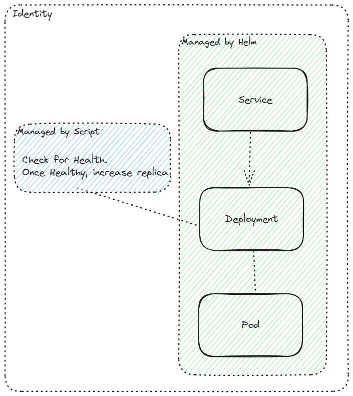

# Camunda 8 Helm Profile: High-Availability Webapps
Some components within the architecture cannot be scaled using the Helm chart due to specific limitations or requirements not covered by the chart.

There is an open issue for this topic: https://github.com/camunda/camunda-platform-helm/issues/975

Verify `yq` command line tool is installed.
yq is a command-line tool designed to manipulate and process YAML files easily.

## Webapps
The Helm chart used for this deployment manages most components efficiently. However, the following components are unable to be scaled directly using the Helm chart:
### Operate / Tasklist

Reason: Only one Importer and Archiver should be present. Can be disabled.

- Operate: `CAMUNDA_OPERATE_IMPORTERENABLED=FALSE` and `CAMUNDA_OPERATE_ARCHIVERENABLED=FALSE`
- Tasklist: `CAMUNDA_TASKLIST_IMPORTERENABLED=FALSE` and `CAMUNDA_TASKLIST_ARCHIVERENABLED=FALSE`

### Optimize

Reason: Only one Importer should be present. Can be disabled via `CAMUNDA_OPTIMIZE_ZEEBE_ENABLED=FALSE`

### Identity

Reason: Can only be scaled after the realm is initialized in Keycloak.

