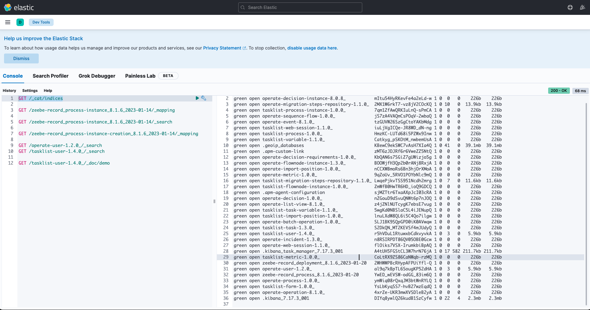

# Camunda 8 Helm Profile: Kibana

This folder contains a [Makefile](Makefile) that can be used to install and configure Kibana into an existing Kubernetes Cluster. 

If you don't have a Kubernetes Cluster yet, see the main [README](../README.md) for details on how to create a cluster on the popular cloud providers.

## Install

Make sure you meet [these prerequisites](https://github.com/camunda-community-hub/camunda-8-helm-profiles/blob/master/README.md#prerequisites).

Open a terminal, cd to this directory, and run:

```sh
make
```

This will install Kibana into the `camunda` namespace.

Setup port forward: 

```shell
make port-kibana
```

Then, access kibana over [http://localhost:5601](http://localhost:5601)

Once in Kibana, browse to the [Dev Tools Console](http://localhost:5601/app/dev_tools#/console) to send commands to elasticsearch and explore.  



## Uninstall
```sh
make clean
````
