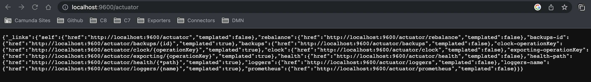
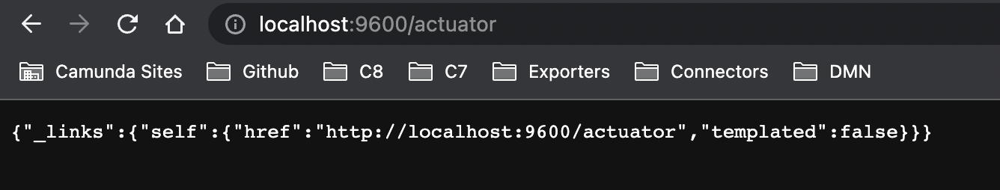

# Disable Zeebe actuator endpoints

[Spring Boot Actuator](https://docs.spring.io/spring-boot/docs/current/reference/html/actuator.html) includes a number of features to help you monitor and manage application. 

The Camunda 8 Platform components make use of Spring Boot Actuator in a number of ways. By default, the actuator endpoints are enabled. However, in some requirements, this might not be desirable. 

This folder contains an example of how to control (enable and/or disable) Zeebe actuator endpoints. 

This example can also be useful as a general reference for how to pass additional configuration parameters to Spring Boot Components deployed in Kubernetes. 

## Usage

Note: you should already have a Kubernetes cluster running before you run this profile. Your `kubectl` should be configured to connect to your existing cluster. If you need to create a cluster, see the main [README.md](../README.md) for guidance.

Edit the [application.yaml](application.yaml) to enable and/or disable whichever actuator endpoints as required. The default example here will disable all endpoints.

Run `make actuator-application-yaml` to create a Kubernetes ConfigMap based on the [application.yaml](application.yaml) in this directory

Follow the example shown inside this [camunda-values.yaml](camunda-values.yaml) file to edit your own `camunda-values.yaml` file to configure each component to use the `additional-application-yaml` configmap as an additional spring application.yaml file. Here's an example snippet of yaml to use: 

```yaml
  env:
    - name: JAVA_TOOL_OPTIONS
      value: "-Dspring.config.additional-location=file:/additional-application-yaml/application.yaml"
  extraVolumeMounts:
    - name: additional-application-yaml
      mountPath: additional-application-yaml
  extraVolumes:
    - name: additional-application-yaml
      configMap:
        name: additional-application-yaml
```

Running `make camunda` from this directory will use this [camunda-values.yaml](camunda-values.yaml) file to install a very simple environment with Zeebe Gateway and one broker, and all actuator endpoints disabled.

## Uninstall

If you're working inside this directory, run `make clean` to clean up Kubernetes objects

## Test

To verify that actuator endpoints are disabled on the gateway, run `make port-actuator` to open a port forward to the `camunda-zeebe-gateway` on port 9600, and then browse to [http://localhost:9600/actuator](http://localhost:9600/actuator)

When endpoints are enabled, the response will look like this: 



When endpoints are disabled, the response will look like this: 


